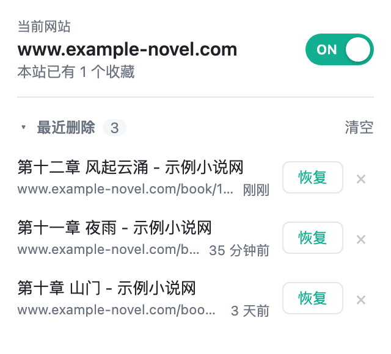

# One Site One Bookmark

> 阅读不丢位，一书一签智能跟。

一个 Chrome 扩展（Manifest V3）：对你开启的网站，每次新建书签时自动删除该网站下的其他旧书签，**同一个网站只保留最新的一个书签**。适合在小说站、文档站等地方记录阅读进度，不用再手动清理一串过期的书签。

## 功能

- **按网站开关**：在哪个网站打开 popup，就只开关哪个网站，其他网站不受影响。
- **开启前确认**：popup 显示当前网站已有多少个收藏；多于 1 个时，开启前会提示「下次收藏会删除现有的 N 个收藏」，确认后才生效。
- **最近删除，可恢复**：被自动删除的书签进入「最近删除」（最多 50 条、保留 7 天），一键恢复到原文件夹、原位置。
  - 默认折叠，显示删除时间；可删除单条记录，或两步确认清空全部。
- **导入保护**：导入书签期间不做任何删除。

## 安装

扩展尚未上架 Chrome 应用商店，需要以「开发者模式」加载：

1. 获取代码（二选一）：
   - 在 [Releases](https://github.com/CccccJJ/One-Site-One-Bookmark/releases)（或仓库的 [`releases/`](releases/) 目录）下载最新的 `one-site-one-bookmark-*.zip` 并解压；
   - 或 `git clone https://github.com/CccccJJ/One-Site-One-Bookmark.git`。
2. 打开 `chrome://extensions`，开启右上角「开发者模式」。
3. 点击「加载已解压的扩展程序」，选择解压后的目录（或仓库根目录）。

## 使用

1. 打开想要记录进度的网站，点击工具栏上的扩展图标，把开关拨到 **ON**。
2. 之后在这个网站按 `Ctrl/⌘ + D` 或点击星标收藏页面，该网站的其他旧书签会被自动删除，只留下刚收藏的这一个。
3. 删错了？打开 popup，展开「最近删除」点击「恢复」。

## 注意事项

- **书签删除本身不可撤销**，「最近删除」是唯一的恢复途径，记录保留 7 天、最多 50 条，且只保存在本机。
- 开启了 Chrome 书签同步时，删除会同步到你的其他设备。
- 「同一网站」按域名（hostname）精确判断：
  - `www.example.com` 与 `example.com` 视为不同网站；
  - 同一域名下的不同书、不同项目会被视为同一网站，互相替换。一个网站上同时在读多本书时请谨慎开启。
- 在 `chrome://` 页面、新标签页等非 http(s) 页面上，开关不可用。

## 权限说明

| 权限 | 用途 |
| --- | --- |
| `bookmarks` | 读取书签以统计数量、删除旧书签、恢复已删除的书签 |
| `storage` | 在本机保存各网站的开关状态与「最近删除」记录 |
| `host_permissions: *://*/*` | 仅用于读取当前标签页的网址，以判断当前是哪个网站；不读取网页内容，不发送任何网络请求 |

## 开发

纯原生 HTML / CSS / JavaScript（ES modules），无构建步骤。修改代码后在 `chrome://extensions` 点击扩展卡片上的刷新即可。

- 架构与约定：[`CLAUDE.md`](CLAUDE.md)
- 开发历史、设计决策与待办：[`DEVLOG.md`](DEVLOG.md)
- 各版本发布说明与安装包：[`releases/`](releases/)
